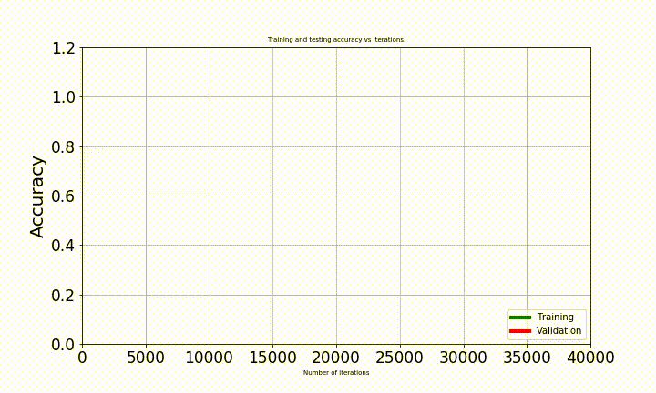

<h1 text-align='center'>Digit Recognizer(Kaggle) using tensorflow.</h1>

<h3>Author: <i>Zynab Smaan.</i></h3>

This reposority represents the solution of the  
<a href='https://www.kaggle.com/c/digit-recognizer'>problem</a> Digit Recognizer.
This problem is to recognize the correct digit (0, 1, ...., 8, 9) from the input  
The input is 28 * 28 image but it's flatten to be 728 vector.
The solution is building simple Neural Network to learn how to detect the digit. 
Also, there is a tutorial about drawing an animated plot for accuracies and save it.

<h4>This solution achieves from 97% to 98% for validation accuracy.</h4>

<h4>Install training data from <a href="https://www.kaggle.com/c/digit-recognizer/download/train.csv">here.</a></h4>
<h4>Install testing data from <a href="https://www.kaggle.com/c/digit-recognizer/download/test.csv">here.</a></h4>

<h5 color='green'>The code is dynamic, you can change:
<li>1 - The number of layers.</li>
<li>2 - The number of nodes in each layer.</li>
<li>3 - Batch size.</li>
<li>4 - Number of iterations.</li>
<li>5 - Learning rate.</li>
<li>6 - split ratio.</li>
<li>7 - keep prop.</li>

<h4>This reposority contains:</h4> 
<li>One jupyter notebook, that contains all the code + documentation.</li>
<li>trains.csv, the training data.</li>
<li>test.csv, the testing file for preduction.</li> 
<li>'my_models' folder contains all saved models, animated videoand information about the models.</li>
 

The name schema takes the form model_(number), model_(number)_info.txt and 
model_(number)_animatedAcc.mp4. <b>For example:</b> model_1, model_1_info.txt and 
model_1_animatedAcc.mp4.

<h4>Dependecies:</h4>
<li>Numpy -- install from <a href="https://docs.scipy.org/doc/numpy/user/install.html">here</a>.</li>
<li>pandas -- install from <a href='https://pandas.pydata.org/pandas-docs/stable/install.html'>here</a>.</li>
<li>SKLearn -- run <b>pip install -U scikit-learn</b>.</li>
<li>Matplotlib -- install from <a href='https://matplotlib.org/3.1.0/faq/installing_faq.html#install-from-source'>here.</a></li>
<li>seaborn 9.0.0 -- run <b>pip install seaborn==0.9.0</b></li>
<li>tensorflow -- Install from <a href="https://www.tensorflow.org/inprestall/pip">here.</a></li>

<h5 style="color:navy">Also You may need to instal Writer "ffmpeg" for save mp4 video.</h5>
<li>Install ffmpeg from <a href='http://blog.gregzaal.com/how-to-install-ffmpeg-on-windows/'>here.</li>
 
 
